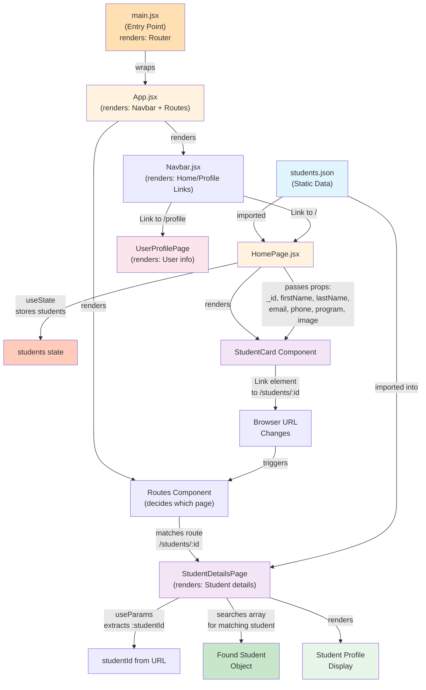

# Project Notes

## General Setup

```bash
npm install
```

---

## How to Set Up Routing

In short:

1. Install the router  
2. Modify `main.jsx` to power it on  
3. Wrap `App.jsx` so routes can be defined  

```bash
npm install react-router-dom
npm run dev
```

---

## What Is the Function of the `main.jsx` File?

Think of `main.jsx` as the **ON / OFF power switch** of a React app.

**Analogy:**

- Your app (`App.jsx`) → the device  
- The browser page (`index.html`) → the wall socket  
- `main.jsx` → pressing the power button  

The code below **turns ON routing for the entire app**:

```jsx
import React from "react";
import ReactDOM from "react-dom/client";
import App from "./App";
import "./index.css";

import { BrowserRouter } from "react-router-dom";

ReactDOM.createRoot(document.getElementById("root")).render(
  <React.StrictMode>
    <BrowserRouter>
      <App />
    </BrowserRouter>
  </React.StrictMode>
);
```

---

## What Is This?

```js
import { Routes, Route } from "react-router-dom";
```

`Routes` (plural) and `Route` (singular) are **traffic signs for your app**.

They decide **what screen shows up for which URL**.

---

### Ultra-Simple Analogy

Imagine your app is a building with rooms:

- The address bar (URL) tells you where you are  
- `Routes` is the **floor map**  
- `Route` is a **sign on each door**

The import line is saying:

> “I want to use the routing tools that let my app change screens **without** reloading the page.”

---

### Why This Matters

**Without routing:**
- One single screen forever  
- Navigation reloads the page like a 1999 website  

**With routing:**
- URL changes  
- Screen changes  
- App stays alive and fast  

**One-line summary:**

- `Routes` = the rulebook  
- `Route` = one rule inside it  

---

## How Do You Establish Routes?

See this `App.jsx` snippet:

```jsx
<Routes>
  <Route path="/" element={<HomePage />} />
  <Route path="/students/:studentId" element={<StudentDetailsPage />} />
  <Route path="/profile" element={<UserProfilePage />} />
</Routes>
```

---

### The Whole Thing in One Sentence

> Depending on the URL, show a different page — without reloading the site.

---

## Line by Line (Plain English)

### `<Routes>`

Think of this as:

> “Pay attention to the address bar and decide what page to show.”

`<Routes>` **listens to the browser URL** and decides what to render.

---

## What Actually Connects to the Browser URL

- **BrowserRouter** → talks to the browser’s address bar  
- **Routes** → reads that information  
- **Route** → matches a rule  

```
Browser URL → BrowserRouter → Routes → Route → Page
```

---

## Why Is the Navbar NOT Routed?

**Short answer:**  
React Router renders **components**, not whole pages.

---

### The Key Mental Model

```
[ Navbar ]   ← stays the same
-------------------------
[ Page Area ] ← this changes
```

React Router is responsible **only for the Page Area**.

---

## Final Analogy

Imagine a TV:

- TV frame + buttons → Navbar  
- Channel content → Routed components  

Changing the channel:
- Does not rebuild the TV  
- Only changes what’s on the screen  

**React Router changes the channel, not the TV.**

---

## App Data Flow Diagram (Rendering & Props)



